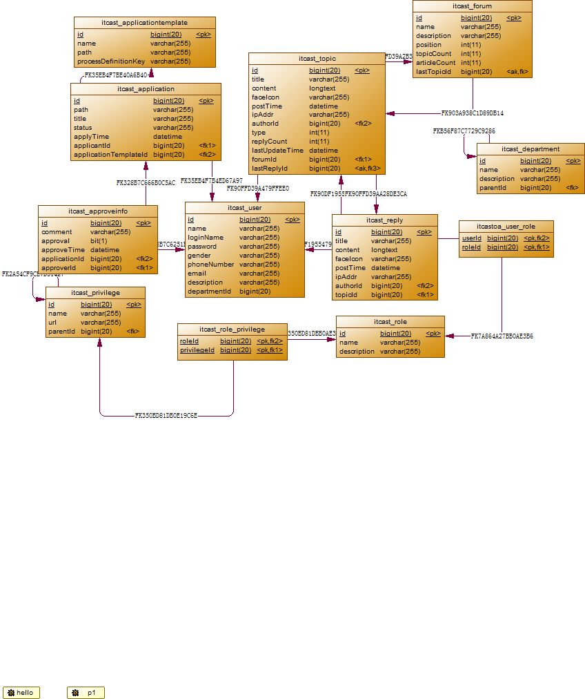

#OA系统简介
##**What is OA?**
官方一点的说法：OA是Office Automation的缩写，本意为利用技术的手段提高办公的效率，进而实现办公的自动化处理。实现信息化、无纸化办公，可方便的生成统计报表等。
说白了，就是提高办公效率的一套软件系统。

项目是暑假的时候，跟着传智播客的视频做的，自己又独立完成了一遍。不能说是自己的项目，不过觉得，从这个视频中收获了很多。把之前学过的三大框架的知识，系统的整合到了一起，在实践中得以运用。[视频的下载地址](http://down.51cto.com/zt/5298)

##**How to Run this project?**

##**1.功能需求**

| 模块| 功能 |
| ------------- |:-------------:| -----:|
| 组织与用户管理 | 岗位管理 |  |
| | 部门管理 |  |
| | 用户管理 |  |
| 系统权限 | 初始化权限| |
| | 分配权限|  |
| | 验证权限|  |
| 网上交流--论坛 | 版块管理 | |
| | 看帖、发帖、回帖|  |
| | 文章管理|  |
| 审批流转（工作流） | 表单模板管理 | |
| | 审批流程管理|  |
| | 审批流转|  |
| | 表单查询|  |


##**2.整体设计**

* 表示层：JSP、Struts2
* 业务逻辑层：Spring2.5
* 数据访问层：Hibernate3.6

##**3.开发工具及涉及技术**

###一、开发环境
* Windows7
* MyEclipse8.5
* Mysql5.5
* Tomcat6.0
* JDK7.0
* Chrome

###二、涉及技术
* Struts2
* Hibernate
* Spring
* jbpm
* junit
* Jquery

##**4.数据库设计**

###一、创建数据库

` create database oa charset utf8; ` 

###二、ER图




###三、数据表含义

| 表名| 字段名 | 字段含义 |
| ------------- |:-------------:| -----:|
| **itcast_user**| loginName |登录名  |
| | password |密码  |
| | name |真实姓名  |
|  | gender|性别 |
| | phoneNumber| 电话号码 |
| | email| 电子邮件 |
| | description |说明 |
| | departmentId|部门号  |
|**itcast_role** | name|角色名称  |
| |description |角色描述 |
| **itcast_privilege**|name |权限名称  |
| |url |链接  |
| | parentId|父权限ID  |
| **itcast_department**|name |部门名称  |
| | description|职能描述  |
| |parentId|父级部门ID|
|**itcast_forum**|name|版块名称|
||description|版块描述|
||position|版块位置|
||topicCount|主题数|
||articleCount|文章数|
||lastTopicId|最近一次发表主题的ID|
|**itcast_topic**|title|帖子主题|
||content|内容|
||faceIcon|图标|
||postTime|发表时间|
||ipAddr|发表者的IP地址|
||authorId|作者ID|
||type|帖子类型（精华、普通、置顶）|
||replyCount|回复数|
||lastUpdateTime|最后一次更新时间|
||forumId|所属版块ID|
||lastReplyId|最后一次回复的ID|
|**itcast_reply**|title|标题(同Topic都继承Article)|
||content|内容|
||faceIcon|图标|
||postTime|发表时间|
||ipAddr|回复者的IP地址|
||authorId|回复者的ID|
||topicId|所属主题的ID|


##**5.公共类的设计**

###1、设计BaseDao
	一般有6个方法
	
```
	void save(T entity);//增
	
	void delete(Long id);
	
	void update(T entity);
	
	T getById(Long id);//查
	
	List<T> findAll();
	
	List<T> getByIds(Long []ids);
```

###2、设计BaseDao实现类

>实现上面6个方法
设计BaseDaoImpl实现
	获取T的真实类型：
	使用反射的方法

	
```
	ParameterizedType pt=this.getClass().getGenericSuperClass();
	clazz=(Class<T>)pt.getActualTypeArguments()[0];
```

##交流与学习

QQ:188273928
CSDN Blog:http://blog.csdn.net/wisewolf_life
Email:wy_lumia@outlook.com
**欢迎交流学习^.^**

